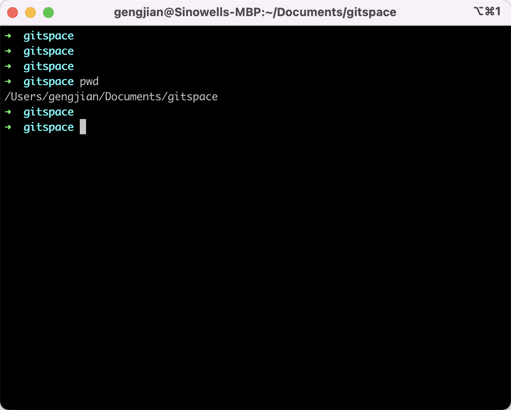
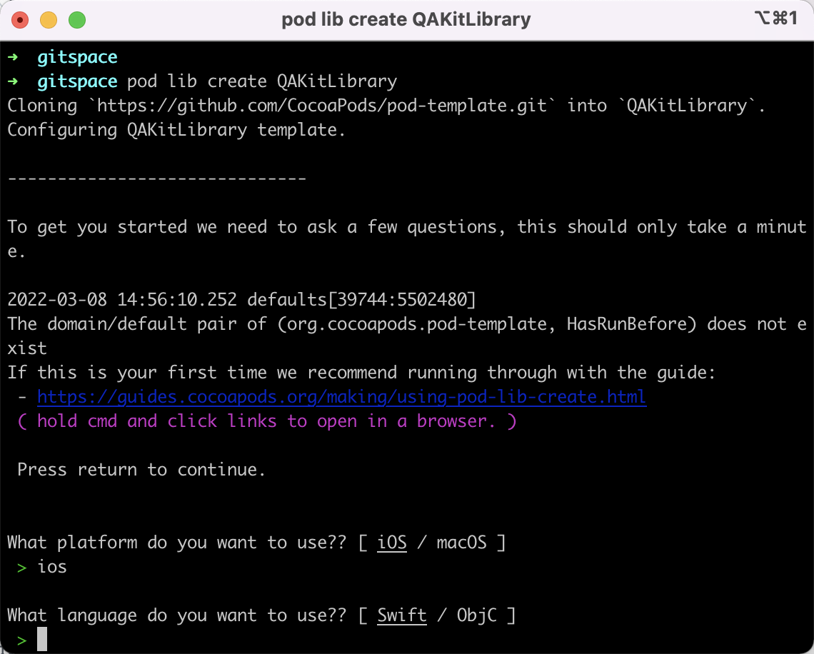
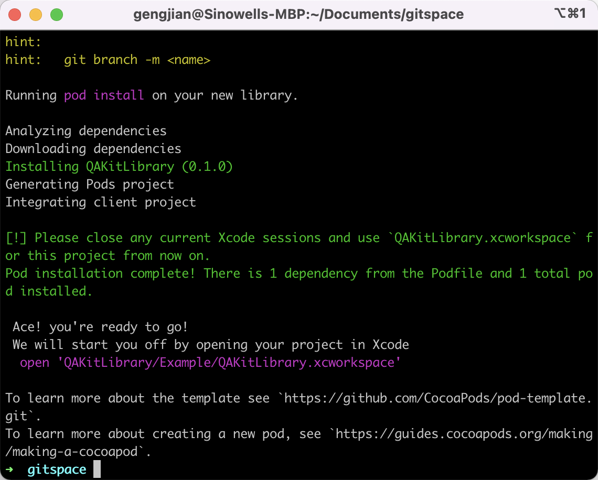
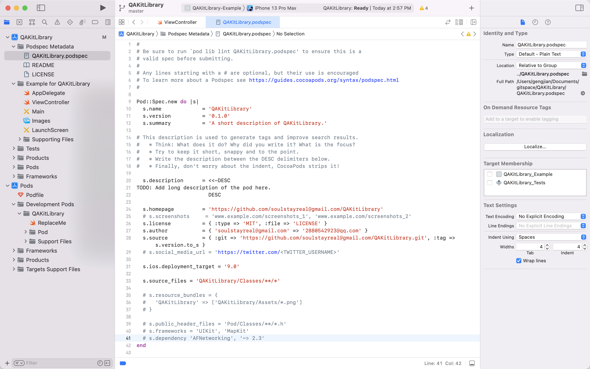
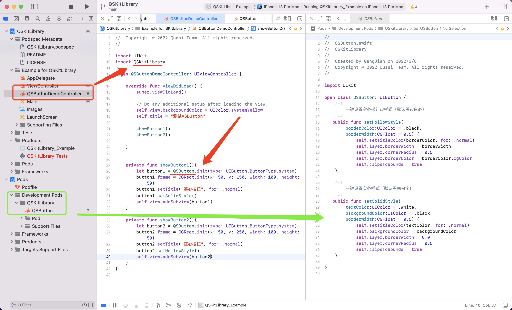
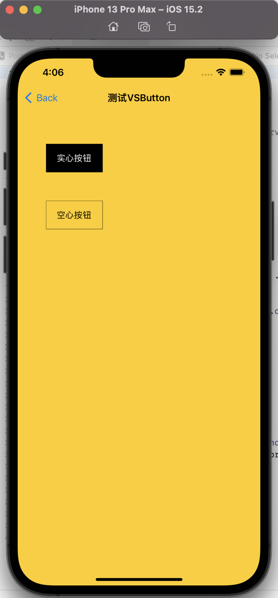
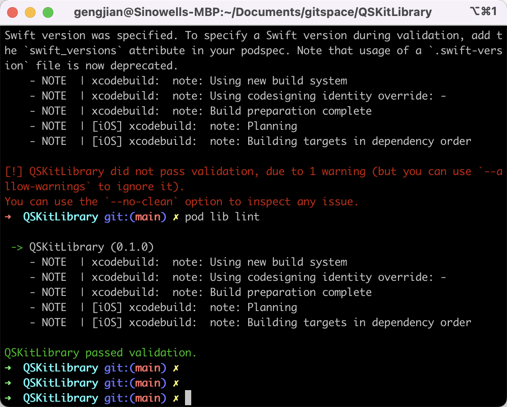
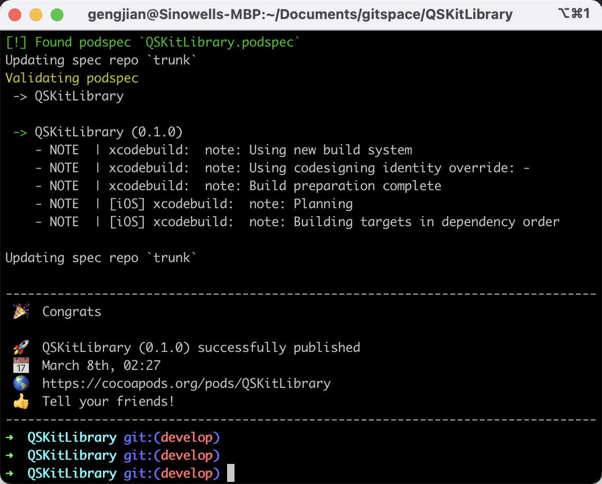

# 创建一个cocoapods组件库并托管

## 整体简介
1. 制作自己的三方库：
通过`https://github.com/CocoaPods/pod-template.git`获取私有库配置模板，编写代码并发布。
2. 分析检查三方库:
包含`本地代码分析 `和`远端代码分析`  
3. 推送托管
区分`共有托管仓库`和`私有托管仓库`

## 详细记录
0. 安装好Cocopods，可以通过命令 ``pod --version`` 检查是否已经安装。

1. 切换到保存目录。因会自动生成git版本相关文件，所以建议单独新建目录。


2. 创建自己的三方库，本质是从远端下载一个配置模板。

```ruby
    pod lib create QSKitLibrary
```




3. 完成创建之后会自动打开Xcode，主要包含的文件如下:


 - **QSKitLibrary.podspec**  整个库的配置文件，约定了最低版本，依赖等内容
 - **Example for QSKitLibrary** 上一步勾选自动生成的演示Demo
 - **Development Pods** 主要的代码托管目录，可编辑区域

 4. 编写代码
 - 删除占位的ReplaceMe文件
 - 打开`/Classes`目录添加代码文件
 - 打开`/Assets`目录添加资源文件

 5. 通过自带的demo测验上述代码
 - 先执行`pod install`编译新加入的代码
 - 再运行`QSKitLibrary`项目(之前截图手滑为QAKitLibrary)
 
 - 运行成功


 6. 将私有库托管到远端Git，保存变更
 此项目已经开源至 https://github.com/quasi-library/ui-sdk-swift.git 欢迎Star和PRs

 7. 检查配置

    Tips： 记得修改podspec中的变量

    
    这里是被检测出未设置Swift版本，修改后重新lint即可。

 8. a.发布到远端（公共仓库）

    ```ruby
    # 查看是否已经登陆
    pod trunk me 
    # 没有的话就去注册，通过邮箱确认
    pod truck xxxxx@mail.com 'username'
    # 发布前要先打Tag并推送到远端（和podspec中配置的相同）
    git tag 0.1.0
    git push origin main
    # 将配置文件推送到公共仓库
    pod trunk push --verbose --allow-warnings
    ```
      
    > 可以通过 pod search 'QSKitLibrary' 即可

    

    b.发布到私有仓库
    // 之前写过总结懒得写了