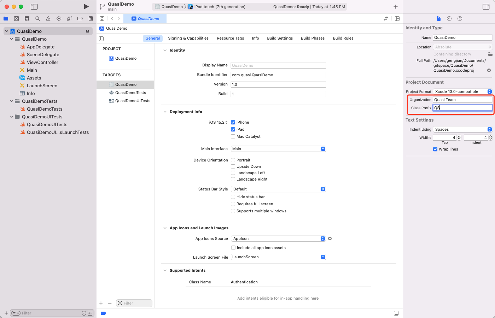
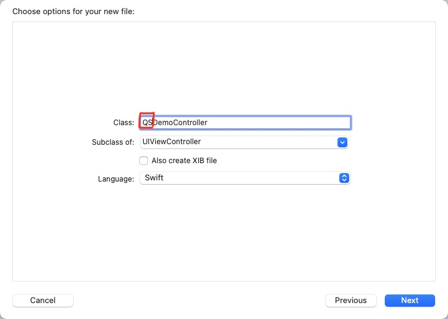
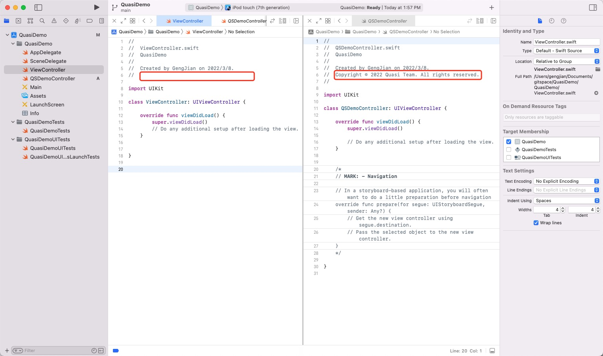

# 新建Xcode项目时的注意事项

## 配置版权及类名前缀 

> 在Objective-C时代为了避免同名文件，方便识别自己的代码和三方的代码，Apple建议采用类名加前缀的方式予以实现；

虽然Swift时代已通过命名空间的方式解决了以上问题，但是此习惯应予以保留。配置路径如下图所示：

完成配置后新建类时会自动添加"QS"前缀

完成配置后新建的文件会自动添加"Copyright"版权声明

